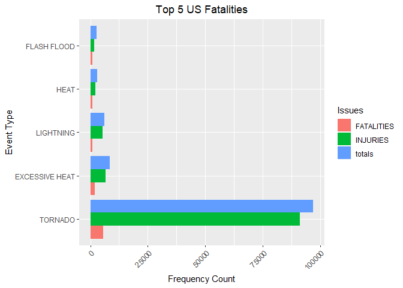
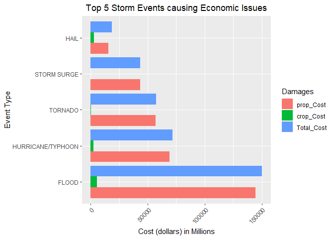

Github repo: [Reproducible Research]

## 1: Synopsis

Storms and other severe weather events can cause both public health and economic problems for communities and municipalities. Many severe events can result in fatalities, injuries, and property damage, and preventing such outcomes to the extent possible is a key concern.

This project goal is to explore the U.S. National Oceanic and Atmospheric Administration's (NOAA) storm database. This database tracks characteristics of major storms and weather events in the United States, including when and where they occur, as well as estimates of any fatalities, injuries, and property damage and find out health and economic issues.

Data:
[Data](https://d396qusza40orc.cloudfront.net/repdata%2Fdata%2FStormData.csv.bz)

Information about Data: [Documentation](https://d396qusza40orc.cloudfront.net/repdata%2Fpeer2_doc%2Fpd01016005curr.pdf)

## 2: Data Processing

### 2.1: Load Data & Clean

Download the  data zip file and extract the data into a data frame.Then convert to a data table for further processing

```r
library("data.table")
library("ggplot2")
#dataFileUrl <- "https://d396qusza40orc.cloudfront.net/repdata%2Fdata%2FStormData.csv.bz2"
#download.file(dataFileUrl, destfile = paste0("C:\\CodeProjects/reproducibleresearch_proj2/data", '/repdata%2Fdata%2FStormData.csv.bz2'))
dataFrame <- read.csv("C:\\CodeProjects/reproducibleresearch_proj2/data/repdata%2Fdata%2FStormData.csv.bz2")
# Converting data frame to data table
stormDataTable <- as.data.table(dataFrame)

colnames(stormDataTable)
```

```
##  [1] "STATE__"    "BGN_DATE"   "BGN_TIME"   "TIME_ZONE"  "COUNTY"    
##  [6] "COUNTYNAME" "STATE"      "EVTYPE"     "BGN_RANGE"  "BGN_AZI"   
## [11] "BGN_LOCATI" "END_DATE"   "END_TIME"   "COUNTY_END" "COUNTYENDN"
## [16] "END_RANGE"  "END_AZI"    "END_LOCATI" "LENGTH"     "WIDTH"     
## [21] "F"          "MAG"        "FATALITIES" "INJURIES"   "PROPDMG"   
## [26] "PROPDMGEXP" "CROPDMG"    "CROPDMGEXP" "WFO"        "STATEOFFIC"
## [31] "ZONENAMES"  "LATITUDE"   "LONGITUDE"  "LATITUDE_E" "LONGITUDE_"
## [36] "REMARKS"    "REFNUM"
```

```r
head(stormDataTable)
```

```
##    STATE__           BGN_DATE BGN_TIME TIME_ZONE COUNTY COUNTYNAME STATE
## 1:       1  4/18/1950 0:00:00     0130       CST     97     MOBILE    AL
## 2:       1  4/18/1950 0:00:00     0145       CST      3    BALDWIN    AL
## 3:       1  2/20/1951 0:00:00     1600       CST     57    FAYETTE    AL
## 4:       1   6/8/1951 0:00:00     0900       CST     89    MADISON    AL
## 5:       1 11/15/1951 0:00:00     1500       CST     43    CULLMAN    AL
## 6:       1 11/15/1951 0:00:00     2000       CST     77 LAUDERDALE    AL
##     EVTYPE BGN_RANGE BGN_AZI BGN_LOCATI END_DATE END_TIME COUNTY_END
## 1: TORNADO         0                                               0
## 2: TORNADO         0                                               0
## 3: TORNADO         0                                               0
## 4: TORNADO         0                                               0
## 5: TORNADO         0                                               0
## 6: TORNADO         0                                               0
##    COUNTYENDN END_RANGE END_AZI END_LOCATI LENGTH WIDTH F MAG FATALITIES
## 1:         NA         0                      14.0   100 3   0          0
## 2:         NA         0                       2.0   150 2   0          0
## 3:         NA         0                       0.1   123 2   0          0
## 4:         NA         0                       0.0   100 2   0          0
## 5:         NA         0                       0.0   150 2   0          0
## 6:         NA         0                       1.5   177 2   0          0
##    INJURIES PROPDMG PROPDMGEXP CROPDMG CROPDMGEXP WFO STATEOFFIC ZONENAMES
## 1:       15    25.0          K       0                                    
## 2:        0     2.5          K       0                                    
## 3:        2    25.0          K       0                                    
## 4:        2     2.5          K       0                                    
## 5:        2     2.5          K       0                                    
## 6:        6     2.5          K       0                                    
##    LATITUDE LONGITUDE LATITUDE_E LONGITUDE_ REMARKS REFNUM
## 1:     3040      8812       3051       8806              1
## 2:     3042      8755          0          0              2
## 3:     3340      8742          0          0              3
## 4:     3458      8626          0          0              4
## 5:     3412      8642          0          0              5
## 6:     3450      8748          0          0              6
```

### 2.2: Subsetting
 

```r
# Finding columns to remove
colstoRemove <- colnames(stormDataTable[, !c("EVTYPE"
  , "FATALITIES"
  , "INJURIES"
  , "PROPDMG"
  , "PROPDMGEXP"
  , "CROPDMG"
  , "CROPDMGEXP")])
# Removing columns not required
stormDataTable[, c(colstoRemove) := NULL]
# Only use data where fatalities or injuries occurred for analysis.  
stormDataTable <- stormDataTable[(EVTYPE != "?" & 
             (INJURIES > 0 | FATALITIES > 0 | PROPDMG > 0 | CROPDMG > 0)), c("EVTYPE"
                                                                            , "FATALITIES"
                                                                            , "INJURIES"
                                                                            , "PROPDMG"
                                                                            , "PROPDMGEXP"
                                                                            , "CROPDMG"
                                                                            , "CROPDMGEXP") ]
```

### 2.3: Convert Exponent Columns into Actual Exponents

Making the PROPDMGEXP and CROPDMGEXP columns with correct exponents  to calculate property and crop cost.

```r
# To uppercase.
cols <- c("PROPDMGEXP", "CROPDMGEXP")
stormDataTable[,  (cols) := c(lapply(.SD, toupper)), .SDcols = cols]
# Alphanumeric exponents to numeric one for calculation.
propertyDamageKey <-  c("\"\"" = 10^0,
                 "-" = 10^0, 
                 "+" = 10^0,
                 "0" = 10^0,
                 "1" = 10^1,
                 "2" = 10^2,
                 "3" = 10^3,
                 "4" = 10^4,
                 "5" = 10^5,
                 "6" = 10^6,
                 "7" = 10^7,
                 "8" = 10^8,
                 "9" = 10^9,
                 "H" = 10^2,
                 "K" = 10^3,
                 "M" = 10^6,
                 "B" = 10^9)

cropDamageKey <-  c("\"\"" = 10^0,
                "?" = 10^0, 
                "0" = 10^0,
                "K" = 10^3,
                "M" = 10^6,
                "B" = 10^9)
stormDataTable[, PROPDMGEXP := propertyDamageKey[as.character(stormDataTable[,PROPDMGEXP])]]
stormDataTable[is.na(PROPDMGEXP), PROPDMGEXP := 10^0 ]
stormDataTable[, CROPDMGEXP := cropDamageKey[as.character(stormDataTable[,CROPDMGEXP])] ]
stormDataTable[is.na(CROPDMGEXP), CROPDMGEXP := 10^0 ]
```

### 2.4: Making Economic Cost Columns


```r
stormDataTable <- stormDataTable[, .(EVTYPE, FATALITIES, INJURIES, PROPDMG, PROPDMGEXP, propCost = PROPDMG * PROPDMGEXP, CROPDMG, CROPDMGEXP, cropCost = CROPDMG * CROPDMGEXP)]
```

### 2.5: Calculate Total Property and Crop Cost in Millions


```r
totalCostDT <- stormDataTable[, .(prop_Cost = sum(propCost)/1000000, crop_Cost = sum(cropCost)/1000000, Total_Cost = sum(propCost)/1000000 + sum(cropCost)/1000000), by = .(EVTYPE)]
totalCostDT <- totalCostDT[order(-Total_Cost), ]
totalCostDT <- totalCostDT[1:5, ]
head(totalCostDT, 5)
```

```
##               EVTYPE prop_Cost crop_Cost Total_Cost
## 1:             FLOOD 144657.71 5661.9685  150319.68
## 2: HURRICANE/TYPHOON  69305.84 2607.8728   71913.71
## 3:           TORNADO  56947.38  414.9533   57362.33
## 4:       STORM SURGE  43323.54    0.0050   43323.54
## 5:              HAIL  15735.27 3025.9545   18761.22
```

### 2.6: Calculate Total Fatalities and Injuries


```r
totalInjuriesDT <- stormDataTable[, .(FATALITIES = sum(FATALITIES), INJURIES = sum(INJURIES), totals = sum(FATALITIES) + sum(INJURIES)), by = .(EVTYPE)]
totalInjuriesDT <- totalInjuriesDT[order(-FATALITIES), ]
totalInjuriesDT <- totalInjuriesDT[1:5, ]
head(totalInjuriesDT, 5)
```

```
##            EVTYPE FATALITIES INJURIES totals
## 1:        TORNADO       5633    91346  96979
## 2: EXCESSIVE HEAT       1903     6525   8428
## 3:    FLASH FLOOD        978     1777   2755
## 4:           HEAT        937     2100   3037
## 5:      LIGHTNING        816     5230   6046
```

## 3: Results

### 3.1: Events that are harmful

Melting data.table so that it is easier to put in bar graph format 

```r
bad_events <- melt(totalInjuriesDT, id.vars="EVTYPE", variable.name = "Issues")
head(bad_events, 5)
```

```
##            EVTYPE     Issues value
## 1:        TORNADO FATALITIES  5633
## 2: EXCESSIVE HEAT FATALITIES  1903
## 3:    FLASH FLOOD FATALITIES   978
## 4:           HEAT FATALITIES   937
## 5:      LIGHTNING FATALITIES   816
```


```r
# Create chart
healthChart <- ggplot(bad_events, aes(x=reorder(EVTYPE, -value), y=value))
# bar chart
healthChart = healthChart + geom_bar(stat="identity", aes(fill=Issues), position="dodge")
#  y-axis scale &  y-axis label
healthChart = healthChart + ylab("Frequency Count") 
#  x-axis label
healthChart = healthChart + xlab("Event Type") 
#  x-axis tick labels 
healthChart = healthChart + theme(axis.text.x = element_text(angle=45, hjust=1))
# chart title
healthChart = healthChart + ggtitle("Top 5 US Fatalities") + theme(plot.title = element_text(hjust = 0.5))+coord_flip()
healthChart
```

<!-- -->

### 3.2: Events that have the more Economic Issues

Melting data.table so that it is easier to put in bar graph format 

```r
economic_issues <- melt(totalCostDT, id.vars="EVTYPE", variable.name = "Damages")
head(economic_issues, 5)
```

```
##               EVTYPE   Damages     value
## 1:             FLOOD prop_Cost 144657.71
## 2: HURRICANE/TYPHOON prop_Cost  69305.84
## 3:           TORNADO prop_Cost  56947.38
## 4:       STORM SURGE prop_Cost  43323.54
## 5:              HAIL prop_Cost  15735.27
```


```r
# ggplot 
economicChart <- ggplot(economic_issues, aes(x=reorder(EVTYPE, -value), y=value),fill=EVTYPE)


# bar chart
economicChart = economicChart + geom_bar(stat="identity", aes(fill=Damages), position="dodge")
#y-axis scale and y-axis label
economicChart = economicChart + ylab("Cost (dollars) in Millions") 
# x-axis label
economicChart = economicChart + xlab("Event Type") 
# x-axis tick labels 
economicChart = economicChart + theme(axis.text.x = element_text(angle=45, hjust=1))
# chart Title
economicChart = economicChart + ggtitle("Top 5 Storm Events causing Economic Issues") + theme(plot.title = element_text(hjust = 0.5))+coord_flip()
economicChart
```

<!-- -->

## 3: Summary
Analysis over storm data reveals that tornado causing more injuries and fatalities than any other events like excessive heat,flash flood,heat,lightning among top five.

When it is coming to evaluate more causes that attributes to property damage and crop damage flood is highest causing event and further hurricane/typhoon and tornado is second and third causing events among top five.

